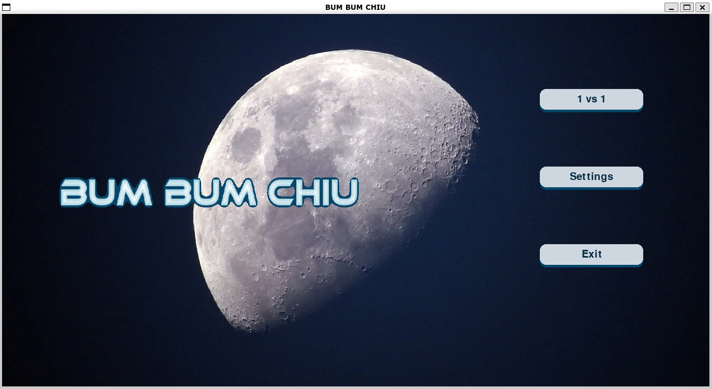
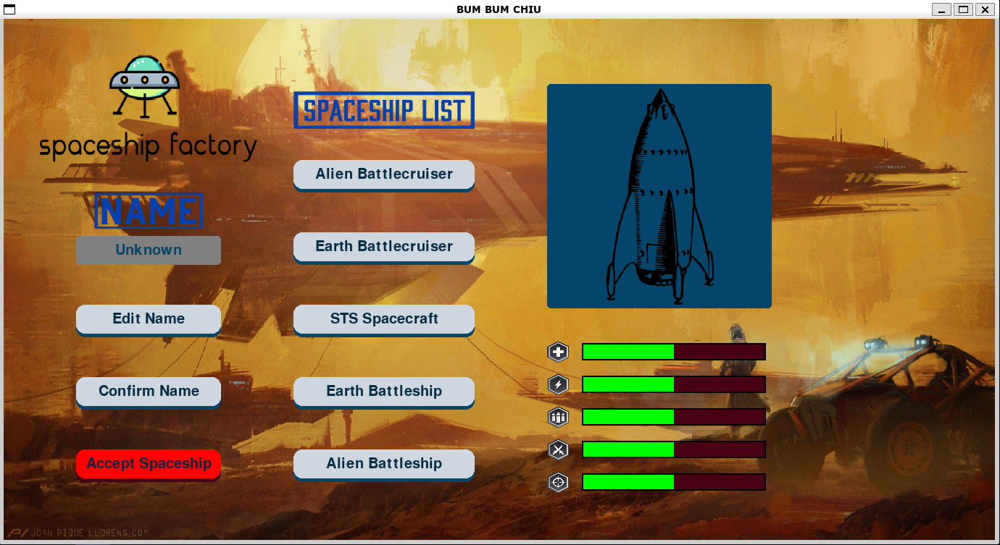
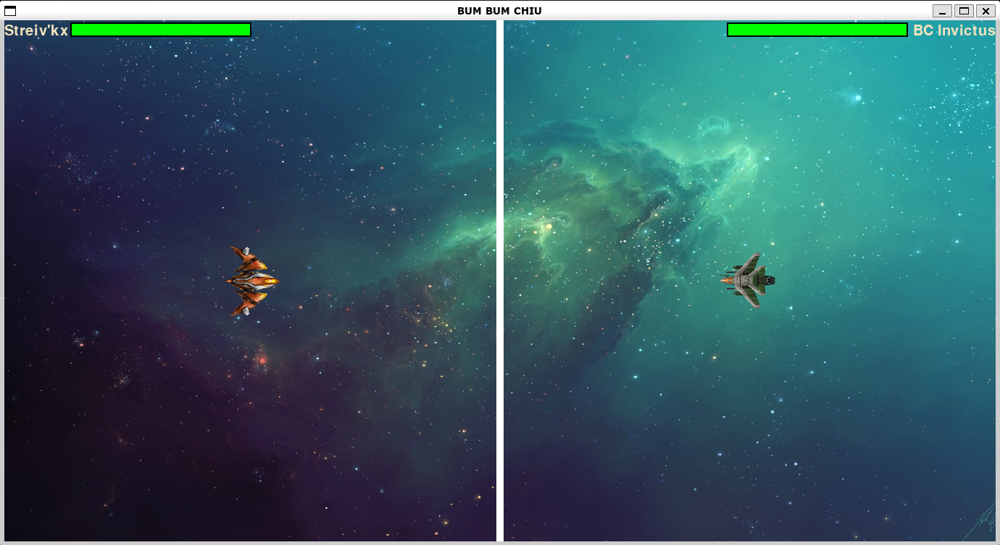

# MiniGame-Python
A simple Space Shooting for 2 players (same PC).

# Usage
Install **pipenv**
```
pip install pipenv
```
Run pipenv shell for virtual env shell terminal and install dependencies for this game
```
pipenv shell
pipenv install
```
run **main.py** to play game
```
python3 main.py
```
# Keys
## Player 1:
- Move: W, A, S, D
- Shoot: F
## Player 2:
- Move: Arrow Up, Arrow Down, Arrow Left, Arrow Right
- Shoot: Numpad-0 (if you don't have numpad keys then sorry 🥲 )

# Screenshots
<figure align="center">
    
    <figcaption>Pic.1 - Start Scene.</figcaption>
</figure>

<figure align="center">
    
    <figcaption>Pic.2 - Choosing spaceship.</figcaption>
</figure>

<figure align="center">
    
    <figcaption>Pic.3 - Let's shooting eachother.</figcaption>
</figure>
